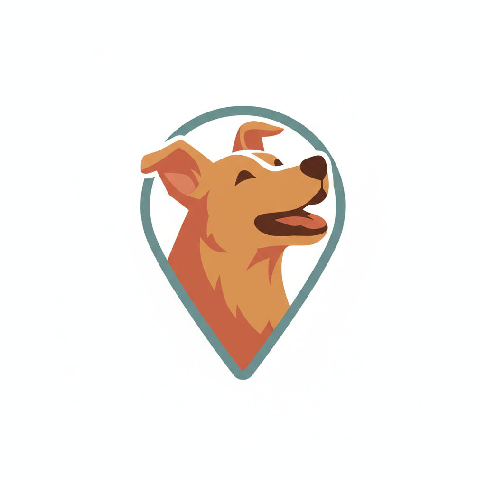

# PetHelp - Monitoramento e Apoio a Animais Abandonados 

---

## Visão do produto

Uma plataforma móvel e colaborativa que conecta cidadãos, ONGs e abrigos para agilizar o resgate e o cuidado de animais em situação de rua. O aplicativo permite que qualquer pessoa reporte um animal avistado, fornecendo dados essenciais para que organizações possam atuar de forma rápida e organizada.

*Nota: Prototipagem visual gerada por IA para fins de conceituação e alinhamento da equipe.*

---

## Stack de tecnologia

- **Frontend (Aplicativo Móvel):** React Native
- **Backend (API):** Node.js
- **Banco de Dados:** PostgreSQL com a extensão PostGIS para geolocalização.
- **Mapas:** OpenStreetMap

---

## Documentos do projeto

- [Requisitos Funcionais e Regras de Negócio](docs/requirements.md)
- [Histórias de Usuário](docs/features.md)
- [Backlog de Tarefas (Kanban)](docs/kanban_tasks.md)
- [Licença do Projeto](LICENSE.md)

---

### Documentação de UI/UX

Abaixo estão os relatórios que documentam o design e a experiência de usuário de cada tela principal do aplicativo, organizados em uma sequência lógica que acompanha a jornada do usuário.

1.  **[Tela inicial e acesso progressivo](docs/ui-ux/relatorio_UI_UX_tela_inicial.md):** Define a porta de entrada do aplicativo e a filosofia de acesso sem atrito.
2.  **[Registro de ocorrência](docs/ui-ux/relatorio_UI_UX_registro.md):** Detalha a funcionalidade principal de reporte de animais.
3.  **[Tela de cadastro e funções](docs/ui-ux/relatorio_UI_UX_tela_cadastro.md):** Explica o fluxo de criação de conta para os diferentes perfis.
4.  **[Tela de login](docs/ui-ux/relatorio_UI_UX_tela_login.md):** Cobre a interface de autenticação para usuários que retornam.
5.  **[Painel principal da ONG](docs/ui-ux/relatorio_UI_UX_painel_ONG.md):** Apresenta a tela de trabalho para as organizações de resgate.
6.  **[Gestão de caso assumido (ONG)](docs/ui-ux/relatorio_UI_UX_gestao_caso_assumido.md):** Detalha como uma ONG gerencia um caso específico.
7.  **[Painel do administrador](docs/ui-ux/relatorio_UI_UX_painel_admin.md):** Mostra a interface de governança da plataforma.
8.  **[Moderação de conteúdo](docs/ui-ux/relatorio_UI_UX_moderacao_conteudo.md):** Descreve o sistema de sinalização e revisão de relatos.
