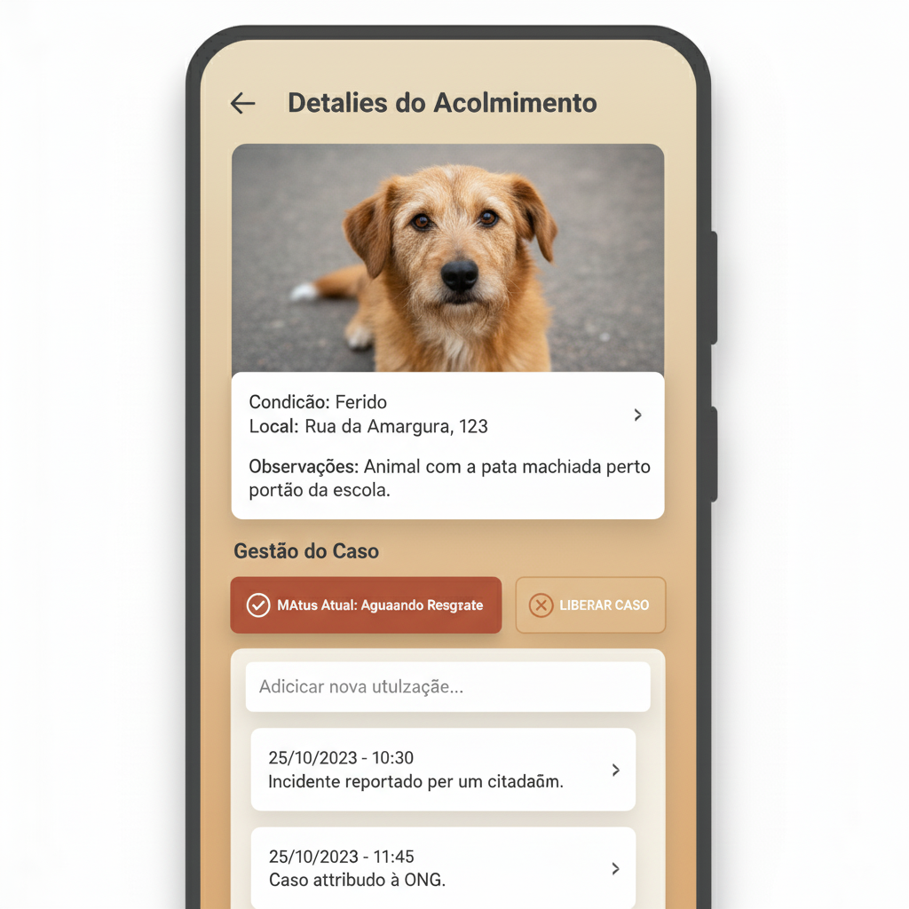

# Relatório de UI/UX: Gestão de Casos Assumidos (Meus Acolhidos)

### **Objetivo**

Projetar a interface que permite às ONGs gerenciar os casos que assumiram, desde o resgate inicial até a conclusão, garantindo um acompanhamento claro e ações bem definidas.

---

### **Princípios fundamentais**

1.  **Clareza de responsabilidade:** A interface deve deixar claro quais casos estão sob a tutela da ONG, separando-os das ocorrências gerais.
2.  **Ciclo de vida do caso:** O design deve facilitar a atualização do status do caso, refletindo seu progresso no mundo real (ex: de "resgate pendente" para "resgatado").
3.  **Registro e histórico:** Manter um histórico simples das ações e atualizações é crucial para a organização da ONG e para a transparência do processo.

---

### **Componente 1: Tela "Meus acolhidos" (A lista)**

Esta é a área centralizada onde a ONG visualiza todos os seus compromissos ativos. É a primeira tela que a ONG acessa para gerenciar seus casos.

-   **Acesso:** Através de um item de destaque no menu principal de navegação.
-   **Layout:** Uma lista de "cards", onde cada card representa um animal sob responsabilidade da ONG.
-   **Filtros:** Um controle no topo da lista para filtrar os casos por **Status** (Ex: "Ver todos", "Aguardando Resgate", "Em Tratamento"), ajudando a ONG a focar no que é mais urgente.

#### **Esboço conceitual da tela "Meus acolhidos"**

*Nota: Prototipagem visual gerada por IA para fins de conceituação e alinhamento da equipe.*

<details>
<summary>Ver wireframe em texto (versão de baixa fidelidade)</summary>

```
+-------------------------------------------+
| ☰ Menu  | Meus Acolhidos                  |
+-------------------------------------------+
|                                           |
|Filtrar por Status: [Aguardando Resgate ▾] |
|                                           |
+-------------------------------------------+
|                                           |
|  +-------------------------------------+  |
|  | [Foto] Cão - Ferido                 |  |
|  | Status: [Aguardando Resgate]        |  |
|  |Assumido em: 22/09/2025  Ver Detalhes > |
|  +-------------------------------------+  |
|                                           |
|  +-------------------------------------+  |
|  | [Foto] Gato - Desnutrido            |  |
|  | Status: [Em Tratamento]             |  |
|  | Assumido em: 21/09/2025 Ver Detalhes > |
|  +-------------------------------------+  |
|                                           |
+-------------------------------------------+
```
</details>
---

### **Componente 2: Tela "Detalhes do caso assumido" (A gestão)**

Esta é a tela de trabalho para um animal específico, acessada ao tocar em um card da lista "Meus Acolhidos".

-   **Estrutura:** A tela é dividida em blocos lógicos: informações originais, status e ações, e histórico de atualizações.
-   **Ações contextuais:** Os botões de ação mudam de acordo com o status atual do caso, guiando a ONG pelo fluxo correto e prevenindo erros.

#### **Esboço conceitual da tela "Detalhes do caso assumido"**

```
+-------------------------------------------+
| < Voltar | Detalhes do Acolhimento         |
+-------------------------------------------+
|                                           |
|  -- Relato Original --                    |
|  [Foto Original do Cidadão]               |
|  Cão, Ferido                              |
|  📍 Rua das Flores, 123 (Ver no mapa)     |
|  Obs: "Parece ter a pata machucada..."    |
|                                           |
+-------------------------------------------+
|                                           |
|  -- Gestão do Caso --                     |
|  Status Atual: [Aguardando Resgate]       |
|                                           |
|  +-----------------------------------+    |
|  |      [✔] MARCAR COMO RESGATADO    |    |
|  +-----------------------------------+    |
|                                           |
|  +-----------------------------------+    |
|  |      [✖] LIBERAR CASO             |    |
|  +-----------------------------------+    |
|                                           |
+-------------------------------------------+
|                                           |
|  -- Histórico e Atualizações --           |
|  +-------------------------------------+  |
|  | Adicionar atualização...            |  |
|  +-------------------------------------+  |
|                                           |
|  - 22/09 13:15: Caso assumido por ONG X.  |
|  - 22/09 13:00: Reportado por Cidadão.    |
|                                           |
+-------------------------------------------+
```
---

[↩️ Voltar ao README Principal](../../README.md)
