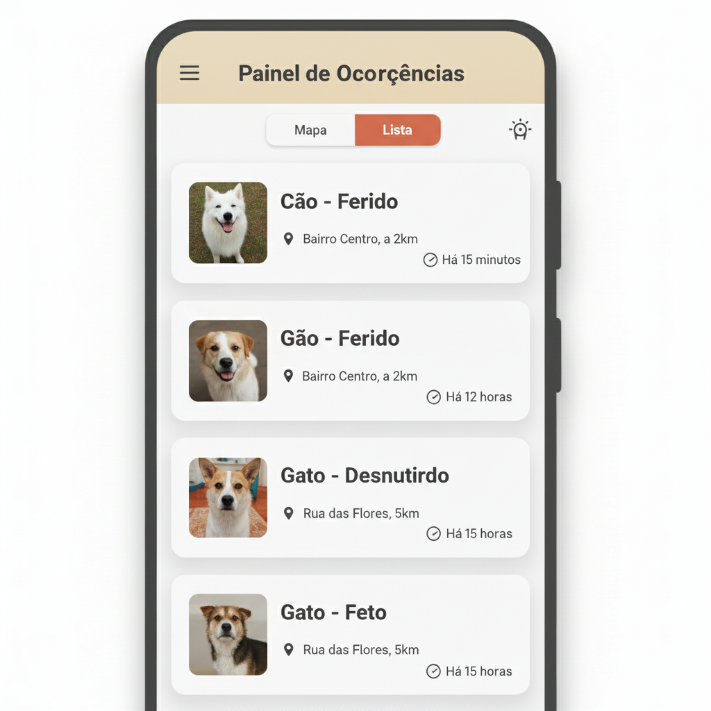

# Relatório de UI/UX: Painel Principal da ONG (Visualização de Ocorrências)

### **Objetivo**

Projetar a tela principal de trabalho para o usuário "ONG", permitindo que ele visualize, filtre e selecione ocorrências abertas para resgate de forma eficiente.

---

### **Princípios fundamentais**

1.  **Visão dupla (Mapa e lista):** Oferecer flexibilidade para que a ONG possa analisar os casos tanto geograficamente quanto por uma listagem ordenada.
2.  **Informação rápida:** Tanto no mapa quanto na lista, a ONG deve conseguir identificar a urgência e o tipo de caso com uma olhada rápida.
3.  **Ação clara:** O caminho para ver os detalhes de um caso e assumi-lo deve ser óbvio e direto.

---

### **Componentes da tela**

1.  **Seletor de visão:** Um controle simples e visível no topo da tela, permitindo alternar entre `[Mapa]` e `[Lista]`. A tela pode carregar a visão de mapa como padrão.
2.  **Filtros:** Um botão ou ícone de filtro (funil) que abre opções para refinar a busca. Para o MVP:
    -   Filtro por proximidade/localização: Permitir que a ONG filtre por cidade ou visualize os casos em um raio de X km de sua localização.
    -   Filtro por tipo de animal: (Cão, Gato, Outro)
    -   Filtro por condição: (Ferido, Desnutrido, Agressivo, etc.)
    -   Um botão "Limpar Filtros" é essencial.
3.  **Visão de mapa:**
    -   **Pins:** Cada ocorrência é um pin no mapa (usando OpenStreetMap).
    -   **Clustering (Agrupamento):** Quando houver muitos pins próximos, eles se agrupam em um único círculo com um número indicando a quantidade de casos ali. Ao dar zoom, os pins se separam.
    -   **Diferenciação Visual:** Os pins podem ter cores ou ícones diferentes baseados na **Condição** do animal (ex: vermelho para "Ferido", amarelo para "Desnutrido").
    -   **Interação:** Ao tocar em um pin (ou cluster), um pequeno card de resumo aparece com informações básicas (Ex: "Cão, Ferido, há 2 horas") e um botão/link para "Ver Detalhes".
4.  **Visão de lista:**
    -   **Formato de Cards:** Cada ocorrência é um "card" em uma lista rolável.
    -   **Ordenação:** Por padrão, a lista deve ser ordenada por mais recente. Futuramente, pode ter opções para ordenar por proximidade.
    -   **Informações no Card:** Cada card deve conter a foto do animal (miniatura), tipo e condição, endereço/bairro aproximado, distância da ONG e data/hora do registro.
    -   **Interação:** Tocar em qualquer lugar do card leva à tela de "Detalhes da Ocorrência".

---

### **Fluxo de ação da ONG**

1.  A ONG faz login e acessa esta tela.
2.  Ela escolhe a visão (Mapa ou Lista) que preferir.
3.  Aplica filtros se necessário (ex: "mostrar apenas cães feridos na minha cidade").
4.  Identifica um caso de interesse.
5.  Clica no pin/card para ver todos os detalhes.
6.  Na tela de detalhes, ela encontrará o botão "Assumir Resgate".

---

### **Esboço conceitual da tela (Visão de lista)**



*Nota: Prototipagem visual gerada por IA para fins de conceituação e alinhamento da equipe.*

<details>
<summary>Ver wireframe em texto (versão de baixa fidelidade)</summary>

```
+-------------------------------------------+
| Menu  Painel de Ocorrências [Mapa][Lista] |
+-------------------------------------------+
|                               [Filtros ▾] |
+-------------------------------------------+
|                                           |
|  +-------------------------------------+  |
|  | [Foto] Cão - Ferido                 |  |
|  | 📍 Bairro Centro, a 2km             |  |
|  | 🕒 Há 15 minutos              Ver > |  |
|  +-------------------------------------+  |
|                                           |
|  +-------------------------------------+  |
|  | [Foto] Gato - Desnutrido            |  |
|  | 📍 Bairro Industrial, a 5km         |  |
|  | 🕒 Há 2 horas                 Ver > |  |
|  +-------------------------------------+  |
|                                           |
+-------------------------------------------+
```
</details>
---

[↩️ Voltar ao README Principal](../../README.md)
