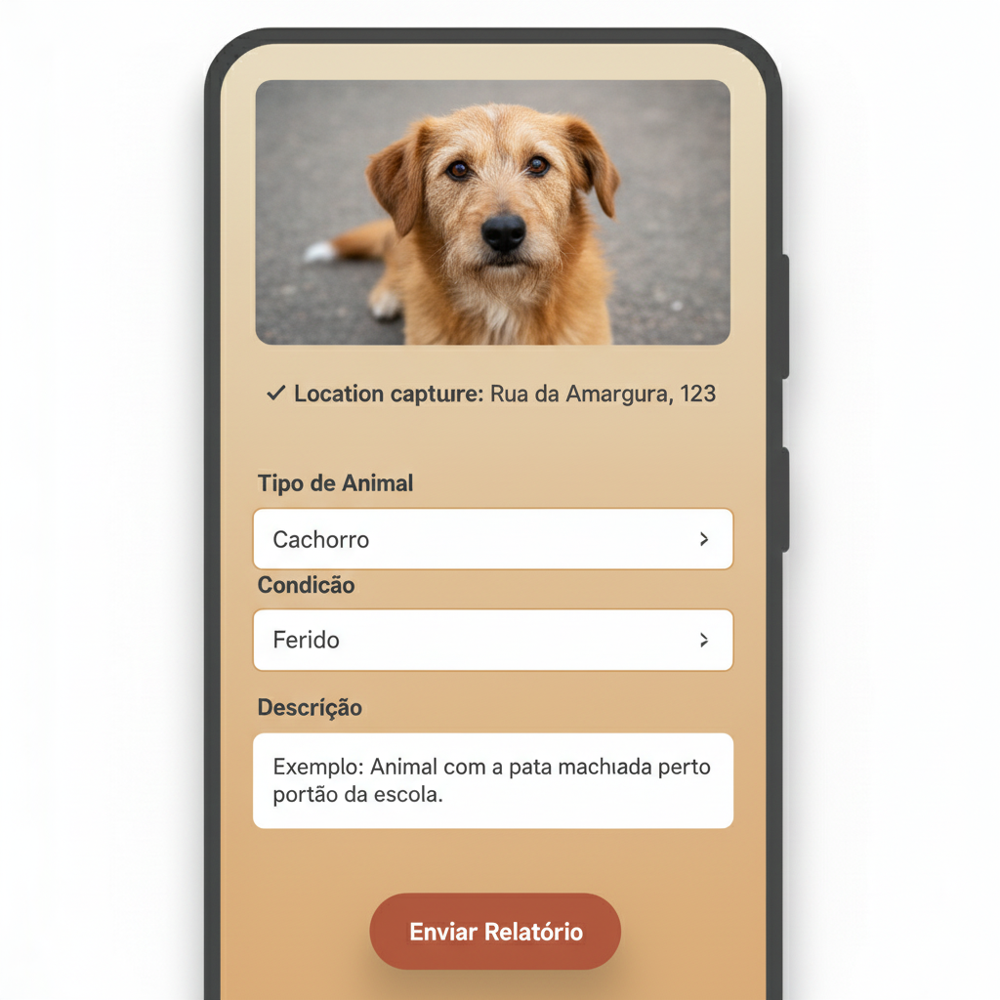

# Relatório de UI/UX: Fluxo de Registro de Ocorrência

### **Objetivo**

Definir uma interface e experiência de usuário que seja simples, intuitiva e funcional para o registro de animais em situação de abandono. O design deve priorizar a rapidez e a facilidade de uso, garantindo que qualquer pessoa possa fazer um registro com o mínimo de esforço.

---

### **Princípios fundamentais**

1.  **Simplicidade é a chave:** A tela de registro deve ter um único objetivo claro: capturar as informações essenciais do animal encontrado. Evitaremos qualquer distração ou campo desnecessário.
2.  **Mínimo esforço do usuário:** O aplicativo deve fazer o trabalho pesado. A geolocalização deve ser automática e a interface deve guiar o usuário de forma natural, passo a passo.
3.  **Feedback imediato:** O usuário precisa saber o que está acontecendo. O app deve confirmar visualmente a captura da foto, a obtenção da localização e o envio bem-sucedido do registro.

---

### **Fluxo de usuário recomendado**

O processo de registro pode ser resumido em 3 etapas principais para o usuário:

1.  **Capturar a evidência (Foto):**
    -   O usuário clica em um botão grande e proeminente.
    -   A interface da câmera é aberta de forma simplificada.
    -   Após a foto, o app mostra uma prévia com opções claras para "Usar esta foto" ou "Tirar outra".

2.  **Preencher detalhes mínimos (Formulário):**
    -   Ao confirmar a foto, a localização (GPS) é capturada automaticamente em segundo plano.
    -   O usuário é levado a uma tela de formulário simples, que já exibe a foto tirada no topo e confirma a localização capturada.
    -   Os campos apresentados são: `Tipo de Animal`, `Condição` e `Descrição`.

3.  **Enviar e confirmar:**
    -   Após o preenchimento, o usuário clica em "Enviar Registro".
    -   O app exibe uma animação de carregamento e uma mensagem de sucesso clara.

---

### **Análise dos campos e sugestões**

#### **Nomenclatura: "Observação" vs. "descrição"**

-   **Análise:** O termo "Descrição" é mais direto e intuitivo para o público geral.
-   **Recomendação:** Utilizar **"Descrição"** e guiar o usuário com um texto de exemplo (placeholder) dentro do campo.

#### **Textos padrão para campos de seleção**

-   **Análise:** Oferecer opções pré-definidas agiliza o preenchimento e padroniza os dados para a gestão.
-   **Sugestões para "Tipo de Animal":** Cão, Gato, Pássaro, Cavalo, Outro.
-   **Sugestões para "Condição":** Aparentemente saudável, Magro / Desnutrido, Ferido, Doente (com sinais visíveis), Assustado / Agressivo, Filhote(s) sozinhos, Não sei avaliar.

---

### **Esboço conceitual da tela de registro**



*Nota: Prototipagem visual gerada por IA para fins de conceituação e alinhamento da equipe.*

<details>
<summary>Ver wireframe em texto (versão de baixa fidelidade)</summary>

```
┌───────────────────────────────────────────┐
│ [ <- Voltar ]      NOVO REGISTRO          │
├───────────────────────────────────────────┤
│                                           │
│   [Pré-visualização da foto tirada]       │
│                                           │
├───────────────────────────────────────────┤
│   [ ✓ Localização capturada: Rua X, Y ]   │
├───────────────────────────────────────────┤
│                                           │
│  Tipo de Animal                           │
│  ┌─────────────────────────────────────┐  │
│  │ Cão                        [ v ]    │  │
│  └─────────────────────────────────────┘  │
│                                           │
│  Condição                                 │
│  ┌─────────────────────────────────────┐  │
│  │ Ferido                     [ v ]    │  │
│  └─────────────────────────────────────┘  │
│                                           │
│  Descrição                                │
│  ┌─────────────────────────────────────┐  │
│  │ O animal está deitado e parece      │  │
│  │ não conseguir mover a pata tra...   │  │
│  └─────────────────────────────────────┘  │
│                                           │
├───────────────────────────────────────────┤
│                                           │
│           [   ENVIAR REGISTRO   ]         │
│                                           │
└───────────────────────────────────────────┘
```
</details>
---

[↩️ Voltar ao README Principal](../../README.md)
