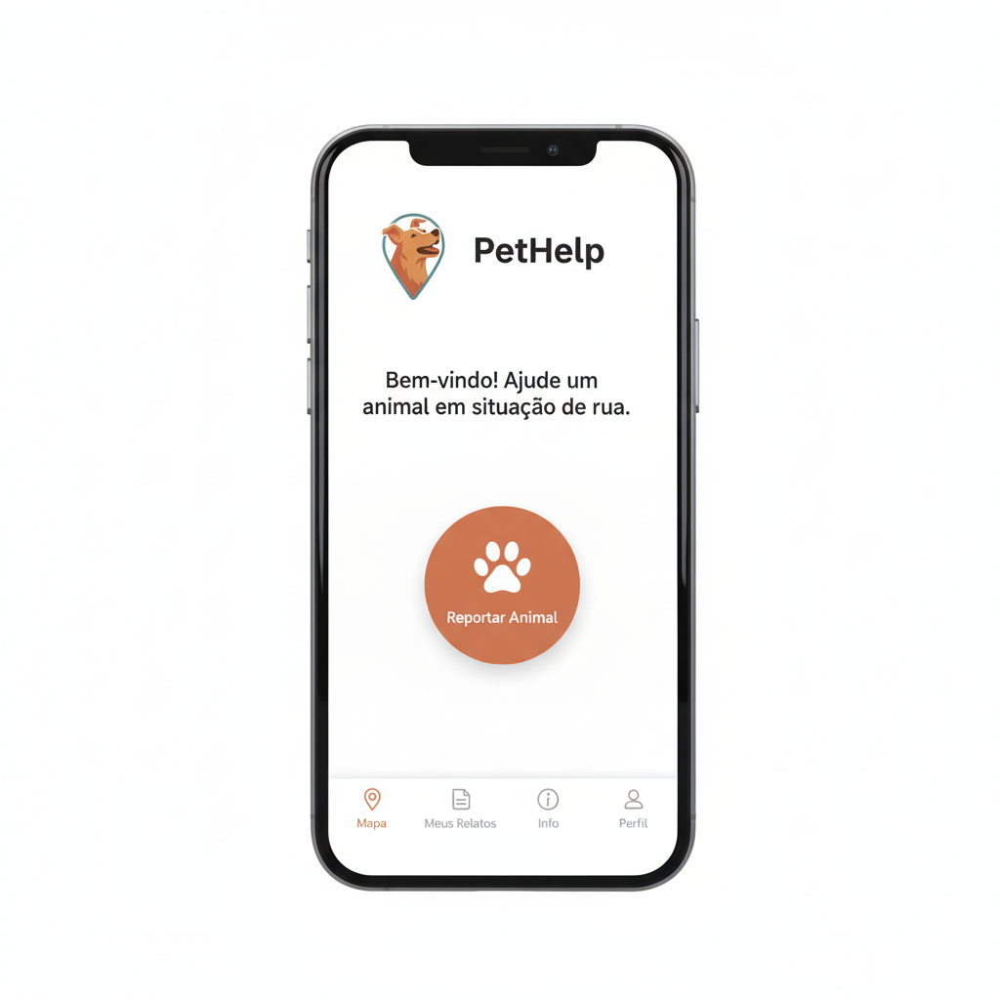

# Relatório de UI/UX: Tela Inicial e Fluxo de Acesso

### **Objetivo**
Projetar uma tela inicial que incentive a ação imediata do usuário e definir um fluxo de acesso sem atritos, garantindo que o cidadão possa registrar uma ocorrência da forma mais rápida e intuitiva possível.

---

### **Princípios fundamentais**

1.  **Foco na Ação Principal:** A interface deve eliminar qualquer dúvida sobre qual é o principal propósito do aplicativo: registrar um animal.
2.  **Acesso Imediato e Sem Barreiras:** O usuário não deve ser obrigado a criar uma conta para realizar a ação principal. A ajuda é urgente; o app deve refletir isso.
3.  **Navegação Secundária Clara:** Outras funcionalidades do aplicativo devem ser facilmente acessíveis, mas sem competir visualmente com a ação primária.

---

### **Fluxo de acesso recomendado: Acesso progressivo**

A estratégia de acesso definida para o projeto é a de **Acesso Progressivo**, em detrimento de um login inicial obrigatório. Esta abordagem é crucial para maximizar o engajamento e a coleta de dados.

-   **Primeiro Contato:** O usuário abre o aplicativo e é direcionado para a tela inicial funcional, sem telas de login ou splash screens obrigatórias.
-   **Ação sem Compromisso:** O usuário pode clicar no botão "Registrar" e completar todo o fluxo de registro de uma ocorrência sem possuir uma conta.
-   **Convite Opcional ao Cadastro:** Após o sucesso do primeiro registro, o aplicativo exibe uma mensagem de agradecimento e oferece a opção de criar uma conta para obter benefícios, como o acompanhamento dos casos reportados.

#### **Vantagens da abordagem**

-   **Maximiza a Coleta de Dados:** Reduz drasticamente a taxa de abandono no início do fluxo.
-   **Melhora a Experiência do Usuário:** O usuário percebe o valor do app antes de precisar fornecer seus dados.
-   **Constrói Confiança:** O app entrega seu valor principal primeiro e só depois pede um compromisso maior (o cadastro).

---

### **Design e layout da tela inicial**

A tela deve ser limpa, com uma hierarquia visual clara que guia o olhar do usuário diretamente para a ação mais importante.

#### **Elemento primário: Botão de ação (Call to Action - CTA)**

-   **Destaque Total:** O elemento central da tela deve ser um botão grande, convidativo e de fácil identificação.
-   **Design:** Pode ser um botão flutuante no estilo "FAB" (Floating Action Button) com um ícone de `+` ou um grande botão centralizado.
-   **Texto Sugerido:** "Registrar Animal Avistado", "Novo Registro" ou "Reportar um Animal".

#### **Elemento secundário: Caixa de navegação**

-   **Posicionamento:** Abaixo do botão de ação principal, para não desviar o foco.
-   **Formato:** Uma grade de ícones com texto, representando as outras áreas do app.
-   **Funcionalidades Sugeridas:**
    -   **Mapa de Ocorrências:** Para visualizar os registros na região.
    -   **Meus Registros:** Leva para uma tela de login/cadastro se o usuário for anônimo, servindo como um incentivo natural.
    -   **Informações:** Para acessar tutoriais e informações sobre a causa animal.
    -   **Perfil:** Onde o usuário pode fazer login, se cadastrar ou editar seus dados.

---

### **Esboço conceitual da tela inicial**
Com certeza. Aqui está o snippet de código apenas com o wireframe da tela inicial.



*Nota: Prototipagem visual gerada por IA para fins de conceituação e alinhamento da equipe.*

<details>
<summary>Ver wireframe em texto (versão de baixa fidelidade)</summary>

```
+-------------------------------------------+
| [Logo Simples]      PetHelp               |
+-------------------------------------------+
|                                           |
|                                           |
|                  Bem-vindo!               |
|    Ajude um animal em situação de rua.    |
|                                           |
|                                           |
|        +---------------------------+      |
|        |                           |      |
|        |   (+) REGISTRAR ANIMAL    |      |
|        |                           |      |
|        +---------------------------+      |
|                                           |
|                                           |
|                                           |
+-------------------------------------------+
|   +-----------------------------------+   |
|  | [Icone]   [Icone]   [Icone] [Icone] |  |
|  |   Mapa      Meus     Info   Perfil  |  |
|   +-----------------------------------+   |
+-------------------------------------------+
```
</details>
---

[↩️ Voltar ao README Principal](../../README.md)
